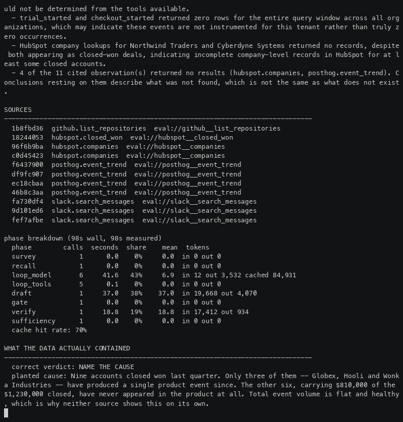

# watcher

**Ask why your numbers moved. Get an investigation, not a dashboard.**

```
$ watcher ask "why did signups fall last week?"
```

> Signups dropped 18%. The largest contributor was mobile traffic, whose conversion
> fell from 4.2% to 2.9%. This began after deploy `91c3e`. Recommendation: roll back
> the onboarding modal.

**Every claim resolves to a stored piece of evidence from a real tool call, or it does not
render.** A claim carries `evidence_id`s; a gate resolves every one against the evidence store
before the report is built; an adversarial verifier then re-reads each claim against only its own
evidence, with no sight of the report. Anything surviving neither is removed, and the report says
it was removed.

It reads what you already have — PostHog, GA4, HubSpot, GitHub, Slack, Mixpanel, BigQuery — and is
only offered the connectors you have credentials for. One is enough to ask a question.

## Watch it work

<p align="center">
  
</p>

Every labelled run ends by printing what was **actually planted in the data**, underneath what it
just claimed — so the question stops being *does this sound right* and becomes *did it get it
right*.

<p align="center">
  
</p>

Seventeen recorded runs, unedited — eleven against labelled datasets, six against a live CRM with
every figure and name masked. Four of the eleven have nothing to find, because the correct answer
is a refusal.

→ **[docs/case-studies/](docs/case-studies/)**

## Quickstart

Needs an LLM key and four datastores. No connector credentials required to try it.

```bash
make setup      # venv + deps from the lockfile + .env with a generated vault key
make up         # Postgres, FalkorDB, Qdrant, Redis
make migrate    # apply schema
make ask DATASET=campaign_traffic_drop   # ~100s, one real investigation
```

That last line runs the production path — real loop, real evidence rows, real grounding gate,
real verifier — over a dataset whose true cause is known, and prints the planted cause afterwards.
It is the cheapest way to find out whether this works before wiring up anything of your own.

Or install it:

```bash
pip install watcher-gtm
cp .env.example .env      # fill in your keys
watcher migrate
watcher ask --dataset campaign_traffic_drop --show-truth
```

Point it at real data once you believe it:

```bash
watcher connect --tenant acme --provider posthog   # secret from the environment, never argv
watcher ask --real --tenant acme "Why did signups fall last week?"
```

| Command | What it does |
|---|---|
| `watcher migrate` | Apply the schema. Run this first |
| `watcher ask` | Run one investigation and print the report |
| `watcher connect` | Store a connector credential in the vault |
| `watcher eval` | Score the analyst against labelled fixtures (spends tokens) |
| `watcher ingest` | Sync a connector's history |

More in [docs/running-it.md](docs/running-it.md). Every setting is documented in
[`.env.example`](.env.example).

## What you need

| | |
|---|---|
| Required | An Anthropic API key |
| Connectors, any subset | PostHog, Mixpanel, GA4, BigQuery, HubSpot, GitHub, Slack |
| Optional | A Slack app (ask by `@mention`), an embedding key (for recall) |

## Status

**Public beta (0.1.0).** The grounding guarantee holds and is measured: across 40 repeated runs of
a labelled suite, delivered hallucinations were 0, and `grounding`, `completeness` and both
verifier precision measures returned an identical score on every attempt.

What is still moving is breadth and route stability — the same question can take a different path
each run. Read a report's *risks* and *data quality* sections, not only its answer.
`watcher eval --variance` reports which numbers move run-to-run and by how much.

## Architecture

Python, FastAPI, and a hand-written investigation loop — a framework's loop is the one part you
cannot reach into, and the loop is where every grounding guarantee is enforced.

- **Read-only by construction.** A connector that is not read-only raises at construction, so
  there is no write path to get wrong.
- **Tenant isolation is structural.** Each tenant gets its own graph and its own vector
  collections; isolation is a property of which graph you open, not a filter someone remembered.
- **Nothing in the scoring path consults a model.** The product's central claim must not be graded
  by the same kind of component it exists to constrain.

Full reasoning in [docs/architecture.md](docs/architecture.md), the decision records in
[docs/decisions/](docs/decisions/), and testing in [docs/testing.md](docs/testing.md).

## Licence

**AGPL-3.0-or-later** ([`LICENSE`](LICENSE)), with a commercial licence available.

The practical difference, because AGPL has a reputation that outruns what it restricts:

| What you are doing | What the AGPL asks |
|---|---|
| `pip install watcher-gtm`, ask questions about your own data | nothing |
| Fork it, modify it, run it inside your company | nothing |
| Run it for your team, your clients' data, your own product's analytics | nothing |
| Offer watcher itself to third parties as a hosted service | release your whole service under AGPL — or take a commercial licence |

That last row is the only one that differs from Apache-2.0, and it is deliberate: the work in
here is the grounding stack, and the intent is that people can use it freely while someone
reselling it as a service either contributes back or pays.

**Commercial licences** — for hosting watcher as a service without the AGPL's reciprocity, or
where your legal team will not accept AGPL at all — are available. Open an issue or email the
address in `pyproject.toml`.

**Contributions** are accepted under the same AGPL-3.0 terms. If a contributor licence agreement
becomes necessary for the dual-licensing to work cleanly, it will be added before, not after, the
first outside contribution is merged — retroactive relicensing needs every contributor's consent
and is how dual-licensed projects get stuck.

**The datastores are a separate question** and the analysis is in
[`docs/licensing.md`](docs/licensing.md): two of the four are source-available rather than open
source, which constrains a *hosted* launch and not self-hosting. It names three routes out, the
cheapest being Redis → Valkey.

## Contributing

Issues and pull requests welcome. Run `make test` and `make lint` before opening one; CI runs
both plus the service-boundary checks.

